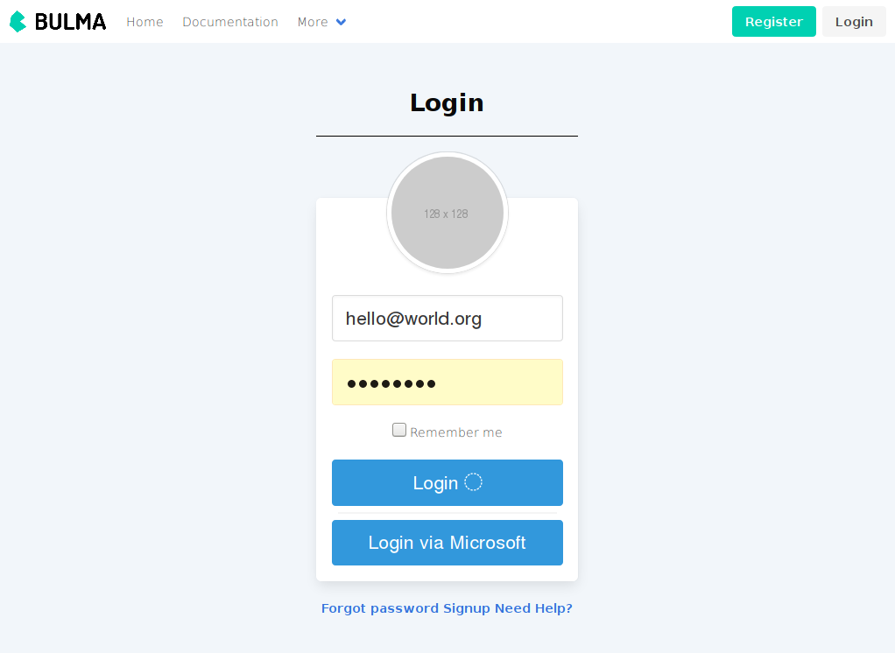

# Bulmable: .NET mvc template with bulma css support

C# and .NET are not my favorite technologies, but what thing attracting me is their identity API. I decided to try this ready to use solution for protecting my web applications. But there is another obstacle: .NET  templates include [Bootstrap](https://getbootstrap.com/docs/3.4/css/) and [jQuery](https://jquery.com/), whereas I use more modern things: [Bulma](https://bulma.io/) as my basic css framework and [Svelte](https://svelte.dev/) for javascripting. How can .NET mvc templates be patched to align my needs?

Let's go:

`dotnet new mvc --auth Individual`

First difficulty I met was absence of source files for registration, login, logout and so on pages. That problem has the solution, described [here](https://docs.microsoft.com/en-us/aspnet/core/security/authentication/scaffold-identity?view=aspnetcore-3.1&tabs=visual-studio).

Second, I use authorization roles for my projects. I have found [here](https://metanit.com/sharp/aspnet5/16.13.php) very easy examples of code for adding roles into .NET  web project.

Third, it's very usefull to add authentication via external services. I added [standard solution from Microsoft](https://docs.microsoft.com/ru-ru/aspnet/core/security/authentication/social/microsoft-logins?view=aspnetcore-3.1) in my `Startup.cs` file.

All that things work together, all right. Now let's try to plug `Boolma` into this project. We can get [simpliest page](https://bulma.io/documentation/overview/start/) for this framework and add some basic components (navigation, login form). Files `Views/Shared/_Layout.cshtml` and `Areas/Identity/Pages/*.cshtml` sould be edited. Putting thingt together gives such result:

Here is also `Dockerfile` where you can see all needed steps to build such project.

TODO:

* add client-side validation without conflicts with basic mvc template;
* clean up bootstrap and jquery files.

